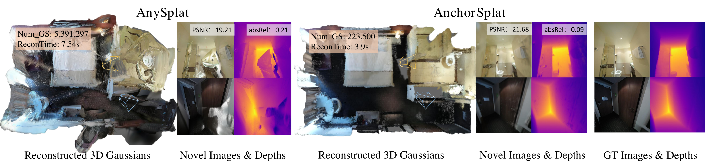
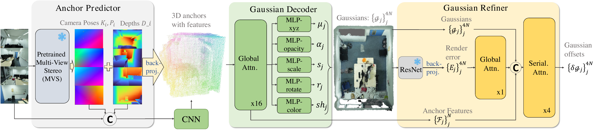
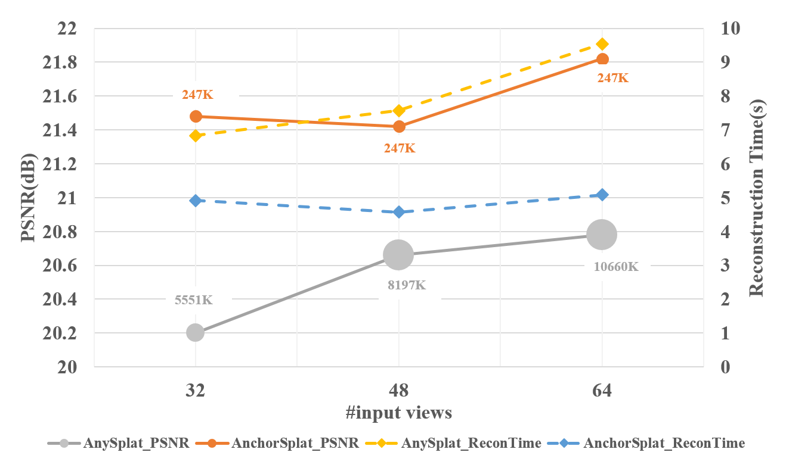

# AnchorSplat

[中文](README_zh.md) | **English**

**AnchorSplat: Feed-Forward 3D Gaussian Splatting with 3D Geometric Priors**  
Official implementation for the paper in `AnchorSplat_arkiv`.

[[Paper](https://arxiv.org/abs/2604.07053)]


<p align="center">
  
  <video src="https://github.com/user-attachments/assets/5a278807-b8be-4238-b74b-4d3de2f3b342" alt="Rendered video" width="100%">
</p>

## Overview

AnchorSplat is a feed-forward 3D Gaussian Splatting framework for scene-level reconstruction. Instead of predicting one Gaussian for each image pixel, it builds sparse 3D anchors from geometric priors and decodes anchor-aligned Gaussians, reducing redundancy while improving view consistency.

This code is developed and tested on Ascend NPU. The model is PyTorch-based and can be migrated to GPU with minimal changes; this README keeps only the NPU workflow.

## Repository Structure

Main repository paths:

```text
AnchorSplat/
  README.md                 # English README, shown by default on GitHub
  README_zh.md              # Chinese README
  LICENSE
  readme/                   # README figures
    teaser.png
    pipeline.png
    psnr_time.png
  src/
    depth_anything_3/
      configs/
        anchorsplat_mix.yaml
      model/
      utils/
    train/
      trainer_mix.py
      dataset_mix.py
      loss.py
      data/                 # ScanNet++ / ARKitScenes scene lists
```

## Pipeline

<p align="center">
  
</p>

- **Anchor Predictor**: predicts camera poses, depths and 3D geometric priors from multi-view images.
- **Gaussian Decoder**: projects multi-view features onto anchors and predicts anchor-aligned 3D Gaussians.
- **Gaussian Refiner**: refines Gaussian attributes with rendering errors for better reconstruction quality.

<p align="center">
  
</p>

## Setup

```bash
git clone https://github.com/Zhang-Xiaoxue/AnchorSplat.git
cd AnchorSplat

conda create -n anchorsplat python=3.10 -y
conda activate anchorsplat

# Install PyTorch, torchvision and torch-npu according to your Ascend CANN version.

pip install addict einops omegaconf opencv-python pillow imageio matplotlib tqdm typer \
  huggingface_hub torchmetrics plyfile trimesh moviepy gradio fastapi uvicorn \
  requests scipy scikit-learn open3d pycolmap evo easydict pillow-heif

export PYTHONPATH=$PWD/src:$PYTHONPATH
```

The NPU renderer depends on the Ascend runtime and the NPU Gaussian rasterization operators, including `acl` and `meta_gauss_render`.

## Dataset Format

### AnchorSplat-style data

Used for ScanNet++ and ARKitScenes:

```text
scene/
  images/
  viewInfo.npz
```

`viewInfo.npz` should include:

```text
image_filenames
T_w2c
K_norm
```

Scene lists:

```text
src/train/data/scannetpp_train.txt
src/train/data/scannetpp_val.txt
src/train/data/arkit_train.txt
src/train/data/arkit_val.txt
```

### Reliev3R-style data

Used for DL3DV and RealEstate10K-style data:

```text
sub_xxx/
  scene/
    rgb/
    scene.npy
```

`scene.npy` is a Python dict and should include:

```text
intr_mat
extr_mat
```

Each scene is expected to have at least `2 * num_views` images. `num_views` is configured in `src/depth_anything_3/configs/anchorsplat_mix.yaml`.

## Model Weights

Default training checkpoint path:

```yaml
model:
  depth_net: ~/ckpts/DA3-GIANT-1.1
```

Before training, update checkpoint and dataset paths in `src/depth_anything_3/configs/anchorsplat_mix.yaml`, or override them from the command line.

## Release Plan

- [ ] Release training checkpoints after upload.

## Train

```bash
torchrun --nproc_per_node=<num_npus> src/train/trainer_mix.py \
  --config src/depth_anything_3/configs/anchorsplat_mix.yaml \
  --output outputs/anchorsplat_mix
```

## Test & Inference

```bash
torchrun --nproc_per_node=<num_npus> src/train/trainer_mix.py \
  --config src/depth_anything_3/configs/anchorsplat_mix.yaml \
  --output outputs/anchorsplat_mix \
  --ckpt outputs/anchorsplat_mix/ckpt/epoch_xxxx.ckpt \
  --test
```

Results are saved under `outputs/anchorsplat_mix/test`, including metrics, visualizations, and optional Gaussian/video exports when enabled in the config.

## Note

The codebase contains a `gsplat` renderer fallback for compatibility, but this repository is documented as an NPU-first release.

## Acknowledgements

This implementation is built by modifying the [Depth Anything 3](https://github.com/ByteDance-Seed/Depth-Anything-3) codebase. We sincerely thank the DA3 authors and contributors for releasing their code.

## Citation

```bibtex
@article{zhang2026anchorsplat,
  title={AnchorSplat: Feed-Forward 3D Gaussian Splatting with 3D Geometric Priors},
  author={Zhang, Xiaoxue and Zheng, Xiaoxu and Yin, Yixuan and Zhao, Tiao and Tang, Kaihua and Mi, Michael Bi and Xu, Zhan and Chen, Dave Zhenyu},
  journal={arXiv preprint arXiv:2604.07053},
  year={2026}
}
```
